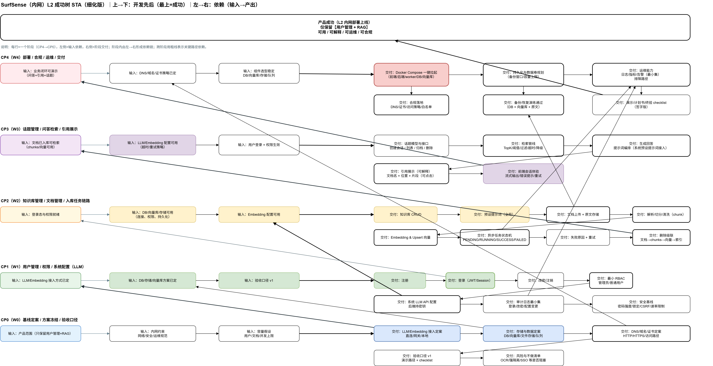

# L2系统架构
> RoadMap: [L2SysArch_Roadmap](./docs/L2SysArch_Roadmap.drawio)

## 1. 产品功能
|1. 用户管理|2. 知识库管理|3. 文档管理|4. 话题管理|
|-|-|-|-|
|注册|创建|上传解析/chunking/Embedding|提问/检索/回答/显示引用|
|登录|查看|查看|归档|
|修改密码|系统预设提示词|删除|删除|
|系统LLM API配置|删除|-|-|
|注销|-|-|-|

## 2. 产品部署
|1. Server|2. Docker|
|-|-|
|TODO|TODO|

## 3. 产品合规
### 3.1 DNS
|1. DNS|
|-|
|TODO|

## 4. 产品算法
|1. ScNN/Sora|2. Ground|
|-|-|
|TODO|TODO|

## 5. 产品推广
|1. 演示|2. 计划书|
|-|-|
|TODO|TODO|

> <<<>>>===========================>>>
# 软件路径
### 1.1 用户管理
#### 1.1.1 注册
|#|Stack|Name|File|Function|Comment|
|-|-----|----|----|--------|-------|
|1|frontend|注册页提交|surfsense_web/app/(home)/register/page.tsx|RegisterPage.submitForm()|校验两次密码一致；调用注册 mutation；成功后跳转登录页|
|2|frontend|注册 mutation|surfsense_web/atoms/auth/auth-mutation.atoms.ts|registerMutationAtom.mutationFn()|把 RegisterRequest 透传给 authApiService.register()|
|3|frontend|调用后端注册 API|surfsense_web/lib/apis/auth-api.service.ts|AuthApiService.register()|zod 校验请求体；HTTP POST /auth/register|
|4|frontend|请求封装/鉴权白名单|surfsense_web/lib/apis/base-api.service.ts|BaseApiService.request()/post()|/auth/register 在 noAuthEndpoints 白名单内；发送 JSON 并做统一错误映射|
|5|backend|注册路由挂载|surfsense_backend/app/app.py|app.include_router(fastapi_users.get_register_router)|暴露 POST /auth/register；注册限流 rate_limit_register；开关控制 registration_allowed|
|6|backend|注册实现|fastapi-users 内置|由 get_register_router(UserRead, UserCreate) 生成 handler|校验/创建用户；写入用户表；返回 UserRead|
|7|backend|注册后初始化钩子|surfsense_backend/app/users.py|UserManager.on_after_register()|创建默认 SearchSpace、默认角色、默认 membership、默认系统 prompts|
|8|Database|用户与初始化数据落库|surfsense_backend/app/db.py|-|用户表模型 User(SQLAlchemyBaseUserTableUUID)（表名通常为 user）；以及 SearchSpace/SearchSpaceRole/SearchSpaceMembership/Prompt 等在注册后被插入|
#### 1.1.2 登录
TODO
#### 1.1.3 修改密码
TODO
#### 1.1.4 系统LLM API配置
TODO
#### 1.1.5 注销
TODO
### 1.2 知识库管理
### 1.2.1 创建
|#|Stack|Name|File|Function|Comment|
|-|-----|----|----|--------|-------|
|1|frontend|弹窗表单提交|surfsense_web/components/layout/ui/dialogs/CreateSearchSpaceDialog.tsx|CreateSearchSpaceDialog.handleSubmit()|弹窗表单提交，调用创建 mutation，成功后跳转 /dashboard/{id}/onboard|
|2|frontend|Jotai mutation 封装|surfsense_web/atoms/search-spaces/search-space-mutation.atoms.ts|createSearchSpaceMutationAtom.mutationFn()|Jotai mutation 封装，转调 API service，并在成功后刷新缓存列表|
|3|frontend|Zod 校验|surfsense_web/lib/apis/search-spaces-api.service.ts|SearchSpacesApiService.createSearchSpace()|HTTP POST /api/v1/searchspaces，request/response 用 Zod 校验|
|4|backend|创建 SearchSpace 记录|surfsense_backend/app/routes/search_spaces_routes.py|create_search_space()|创建 SearchSpace 记录（SearchSpaceCreate 入参），flush 拿到 ID|
|5|backend|初始化 RBAC|surfsense_backend/app/routes/search_spaces_routes.py|create_default_roles_and_membership()|为新知识库初始化 RBAC（Owner/Editor/Viewer）并把创建者写入 membership（owner）|
|6|Database|写入表|surfsense_backend/app/db.py|SearchSpace / SearchSpaceRole / SearchSpaceMembership|写入表 searchspaces、search_space_roles、search_space_memberships；默认角色配置来自 get_default_roles_config()|
### 1.2.2 查看
TODO
### 1.2.3 系统预设提示词
TODO
### 1.2.4 删除
TODO
### 1.3 文档管理
### 1.3.1 上传解析/chunking/Embedding
|#|Stack|Name|File|Function|Comment|
|-|-----|----|----|--------|-------|
|1|frontend|组装 FormData|documents-api.service.ts|uploadDocument()|组装 FormData(files, search_space_id, should_summarize, use_vision_llm, processing_mode)，调用 POST /api/v1/documents/fileupload（批量分片上传）|
|2|backend|让UI立刻可见|documents_routes.py|create_documents_file_upload()|Phase1 先创建/更新 Document(status=pending, title=filename, content="Processing...") 让 UI 立刻可见；Phase2 调 dispatcher.dispatch_file_processing(...) 投递后台任务。|
|3|backend|调用 Celery|task_dispatcher.py|CeleryTaskDispatcher.dispatch_file_processing()|调用 Celery process_file_upload_with_document_task.delay(...)|
|4|backend|执行解析+索引document_tasks.py|process_file_upload_with_document_task()|加载 Document，置 status=processing，调用 process_file_in_background_with_document(...) 执行解析+索引；失败则置 status=failed(reason)。|
|5|backend|统一“解析入口”|file_processors.py|_extract_file_content()|统一“解析入口”，调用 EtlPipelineService.extract(EtlRequest) 得到 markdown_content（以及 etl_service）|
|6|backend|文件类型分类|etl_pipeline_service.py|EtlPipelineService.extract()|按文件类型分类（document/image/plaintext…），并按配置 ETL_SERVICE 路由到解析器，产出 EtlResult.markdown_content|
|7|backend|解析为 markdown 文本|parsers/docling.py|unstructured.py|parse_with_docling() | parse_with_unstructured()|把 file_path 解析为 markdown 文本（主产物）|
|8|backend|开始indexing|file_processors.py|process_file_in_background_with_document() → UploadDocumentAdapter.index()|拿到 markdown_content 后进入 indexing；这里开始 chunking/embedding|
|9|backend|包装成 ConnectorDocument|file_upload_adapter.py|UploadDocumentAdapter.index() → IndexingPipelineService.index()|把 markdown 包装成 ConnectorDocument，调用 indexing pipeline|
|10|backend|chunking|document_chunker.py|chunk_text(source_markdown)|chunk 文本列表|
|11|backend|embedding|document_embedder.py|embed_texts([summary_or_content, *chunks])|summary embedding + chunk embeddings|
|12|Database|落库|-|-|写 Document.embedding、写多条 Chunk(content, embedding)，最后 Document.status=ready()|
### 1.3.2 查看
TODO
### 1.3.3 删除
TODO
### 1.4 话题管理
### 1.4.1 提问/检索/回答/显示引用
|#|Stack|Name|File|Function|Comment|
|-|-----|----|----|--------|-------|
|1|frontend|发起提问|surfsense_web/app/dashboard/[search_space_id]/new-chat/[[...chat_id]]/page.tsx|onNew(message)|组装 NewChatRequest（chat_id/search_space_id/user_query/mentioned_* /disabled_tools），fetch POST /api/v1/new_chat，readSSEStream() 消费 SSE（text-delta/tool-*）更新消息 UI|
|2|backend|鉴权SSE|surfsense_backend/app/routes/new_chat_routes.py|handle_new_chat(request: NewChatRequest, session, user)|校验 thread & 权限；根据 SearchSpace.agent_llm_id 选 LLM config；返回 StreamingResponse(stream_new_chat(...))|
|3|backend|RAG 主编排：创建 Agent + 事件流转 SSE|surfsense_backend/app/tasks/chat/stream_new_chat.py|stream_new_chat(...)|加载 LLM → create_surfsense_deep_agent(...) → agent.astream_events(...)；把事件格式化成 Vercel AI SDK SSE（text-delta/tool-* / data-*）逐条 yield 给前端|
|4|backend|检索：每轮对最后一句用户输入做 KB 检索并注入“可读文档”|surfsense_backend/app/agents/new_chat/middleware/knowledge_search.py|KnowledgeBaseSearchMiddleware.abefore_agent(state, runtime)|对最后一条 HumanMessage 做 query rewrite/时间范围（_plan_search_inputs）→ search_knowledge_base(...)（hybrid search）→ build_scoped_filesystem(...)（把 chunks 生成 <chunk id='...'> XML）→ 注入“合成 ls(/documents)”让模型后续用 read_file 读取 chunk|
|5|backend|引用：强制模型在回答里输出 [citation:chunk_id]|surfsense_backend/app/agents/new_chat/system_prompt.py|SURFSENSE_CITATION_INSTRUCTIONS|要求所有基于文档的事实都用 [citation:<chunk id>] 标注（chunk_id 来自 Step4 生成的 XML）|
|6|backend|显示引用：把 [citation:*] 变成可点击组件|surfsense_web/components/assistant-ui/markdown-text.tsx|parseTextWithCitations()（CITATION_REGEX）|把 [citation:123] / [citation:doc-123] / [citation:https://...] 替换为 InlineCitation/UrlCitation|
|7|frontend|点击引用查看|surfsense_web/components/assistant-ui/inline-citation.tsx|InlineCitation({ chunkId, isDocsChunk })|点击后打开 SourceDetailPanel 展示 chunk 来源详情（按 chunkId 拉取/展示）|
### 1.4.2 归档
TODO
### 1.4.3 删除
TODO
